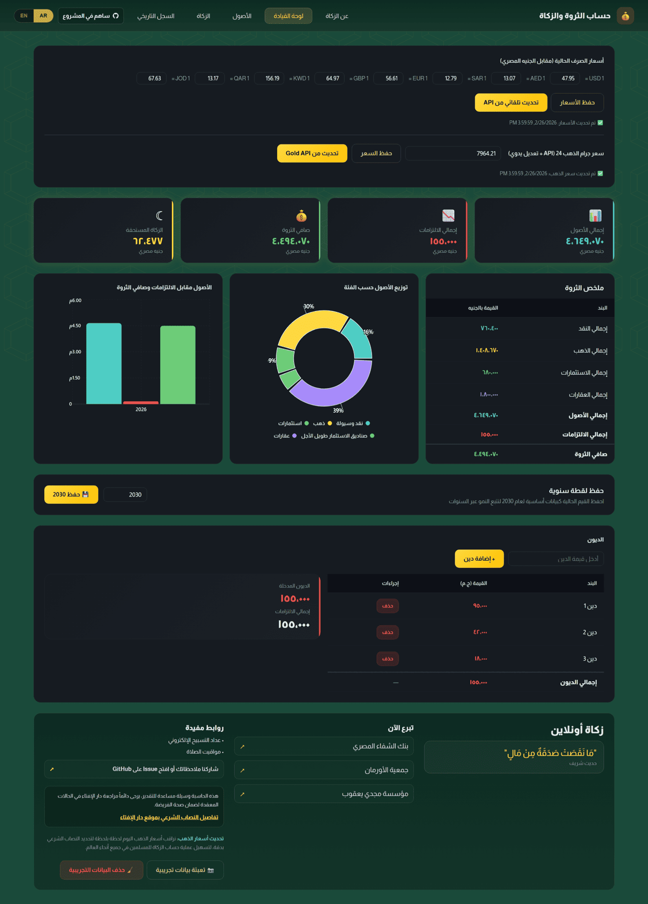
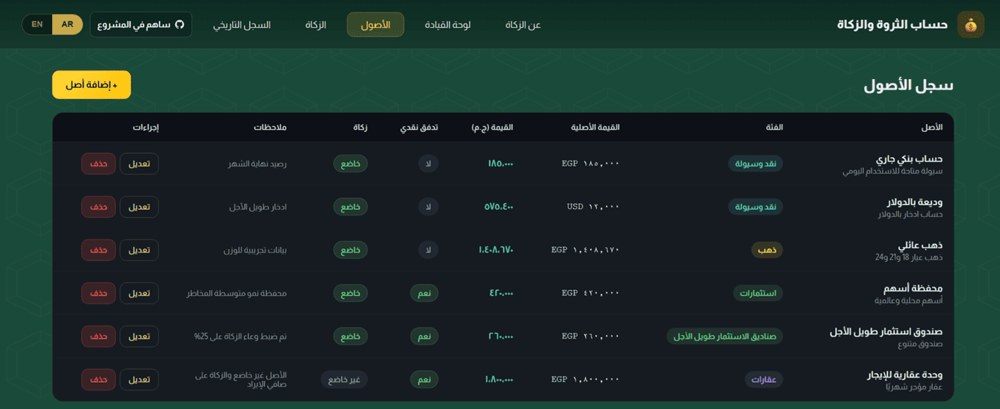
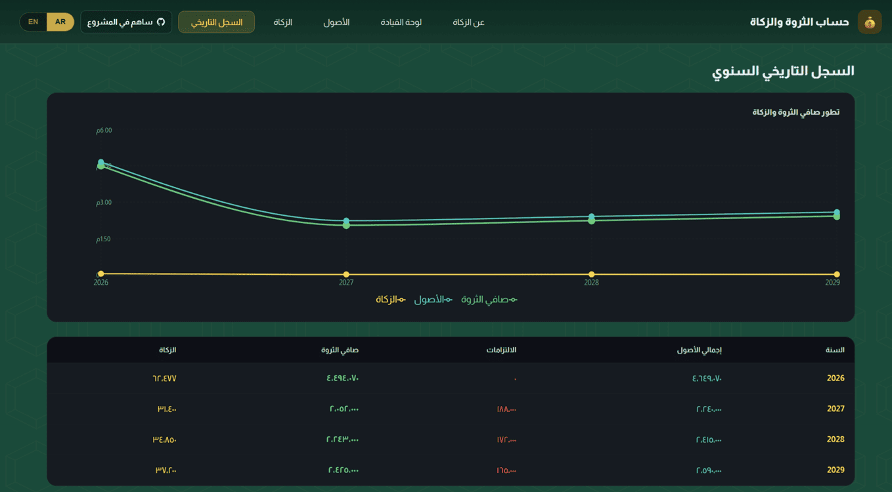

# Zakat & Net Worth Tracker - اداة حساب الثروة والزكاة

A simple bilingual (Arabic/English) Zakah and wealth tracking app that helps users:
- Track assets, debts, and net worth
- Calculate Zakah due based on configurable Zakah basis rules
- Auto-fetch exchange rates and 24K gold price from API
- Estimate gold value from weight by karat (18/21/24)
- Export reports to Excel and PDF

🌐 **[Live Calculator | حساب الزكاة عبر هذا الرابط](https://zakat.mahmoudatallah.com/)**

## ✨ Features
This app is designed to make Zakah estimation clear, practical, and fast for day-to-day use.

- **Bilingual UI (Arabic/English):** Switch language instantly with RTL/LTR support.
- **Smart Asset Tracking:** Manage assets by category with automatic EGP normalization.
- **Gold-Specific Workflow:** Enter gold by karat weights (18/21/24), auto-convert to pure gold, and calculate value from live gold price.
- **Live API Data:** Fetch exchange rates and 24K gold price with manual override support.
- **Debt Management:** Add/remove debts dynamically and include them in net and Zakah calculations.
- **Zakah Estimation:** Compute Zakah base and due amount with category-aware rules.
- **Reports Export:** Generate downloadable Excel and PDF reports for records and sharing.

## 📸 Screenshots

### About

### Dashboard

### Assets

### History

## 💱 Supported Currencies
| Code | Currency | Symbol |
|---|---|---|
| USD | US Dollar | $ |
| SAR | Saudi Riyal | ر.س |
| EUR | Euro | € |
| GBP | British Pound | £ |
| AED | UAE Dirham | د.إ |
| EGP | Egyptian Pound | ج.م |
| KWD | Kuwaiti Dinar | د.ك |
| QAR | Qatari Riyal | ر.ق |
| JOD | Jordanian Dinar | د.أ |
| GOLD_G | Gold (per gram) | — |

## 🧮 Zakat Calculation Logic
- Asset values are normalized to EGP using current exchange rates.
- Zakat base per asset = `Asset Value (EGP) × Zakat Basis Ratio`.
- Net Zakatable Base = `Total Zakatable Assets - Total Debts` (minimum is 0).
- Zakat Due = `Net Zakatable Base × 0.025`.
- Gold can be entered by karat weight (18/21/24), converted to pure 24K equivalent, then priced by current 24K gram rate.

### Investment Assets (Stocks / Funds) Logic
- For investment assets, the app applies the same base formula:
   - `Investment Zakat Base = Investment Value (EGP) × Zakat Basis Ratio`
- In **Investment Funds** category, the default Zakat basis ratio is set to `0.25`.
- You can adjust the ratio when needed (for example, based on portfolio composition or your preferred fiqh method).
- Example:
   - If stock/fund value is `100,000 EGP` and ratio is `0.25`, then:
   - `Zakatable Base = 25,000 EGP`
   - `Zakat Due = 25,000 × 0.025 = 625 EGP`

## 🛠️ Technical Stack
- **Frontend:** React 18 + Vite
- **Charts:** Recharts
- **Export:** XLSX, jsPDF, jspdf-autotable
- **Language/UI:** Arabic/English with RTL/LTR support
- **Runtime:** Browser-based single-page app

## 🔒 Privacy
- No data is sent anywhere except the exchange rate API request (which sends no personal data).
- All Zakat calculations happen entirely in your browser.
- No cookies, no analytics, no tracking.

## Why This Tool Is Useful
This tool is designed for end users who want a practical way to estimate their Zakah with transparent inputs and clear summaries. It reduces manual calculation errors and keeps everything in one place during the active browser session.

## Author
**Mahmoud A. Atallah**

If you want to change author info, update this section directly.

## Contributors
Contributions are welcome.

You can contribute by:
- Reporting bugs
- Suggesting UX or calculation improvements
- Improving Arabic/English wording and documentation
- Submitting pull requests

### Repository Links
- Repository: https://github.com/3tallah/Wealth-Zakat-Tracker
- Open Pull Request: https://github.com/3tallah/Wealth-Zakat-Tracker/compare
- Star the Project: https://github.com/3tallah/Wealth-Zakat-Tracker/stargazers
- Fork the Project: https://github.com/3tallah/Wealth-Zakat-Tracker/fork

### Contribution Workflow (Fork + Branch + PR)
1. Fork the repository from GitHub:
   - https://github.com/3tallah/Wealth-Zakat-Tracker/fork
2. Clone your fork locally:
   - `git clone https://github.com/<your-username>/Wealth-Zakat-Tracker.git`
3. Go to the project folder:
   - `cd Wealth-Zakat-Tracker/zakah-calc/app`
4. Make sure your work starts from the `main` branch:
   - `git checkout main`
   - `git pull origin main`
5. Create a branch for your change:
   - Feature: `git checkout -b feature/short-description`
   - Bug fix: `git checkout -b fix/short-description`
6. Install and test locally:
   - `npm install`
   - `npm run dev`
   - `npm run build`
7. Commit your changes:
   - `git add .`
   - `git commit -m "feat: short description"`
8. Push your branch:
   - `git push origin feature/short-description`
9. Open a Pull Request to `main`:
   - https://github.com/3tallah/Wealth-Zakat-Tracker/compare

### Pull Request Tips
- Keep PRs focused (one feature/fix per PR).
- Include screenshots for UI changes.
- Mention related issue numbers when available.
- Ensure `npm run build` passes before creating the PR.

If your repository is on GitHub, also set the same repo URL in the app constant `CONTRIBUTION_URL` inside `financial-tracker.jsx` so users can use the header “Contribute” button.

## Quick Start
1. Open a terminal in this folder.
2. Install dependencies:
   - `npm install`
3. Start the development server:
   - `npm run dev`
4. Open the local URL shown in the terminal.

## Prerequisites
- Node.js 18+
- npm 9+
- Internet access (for exchange rates and gold API updates)

## Usage
- Go to **Assets** to add assets.
- Use **Debts** section in Dashboard to add/remove debts.
- For **Gold** assets, enter weights (18/21/24) and let the app auto-calculate value from the live gold price.
- Review totals and Zakah results in **Dashboard** and **Zakat** tabs.
- Export report via **Export Excel report**.

## Documentation
- Main app file: `financial-tracker.jsx`
- Entry point: `src/main.jsx`
- Build config: `vite.config.js`

For deeper technical docs, you can extend this README with architecture notes and API details.

## License
This project is licensed under the MIT License.

See the `LICENSE` file for full text.
